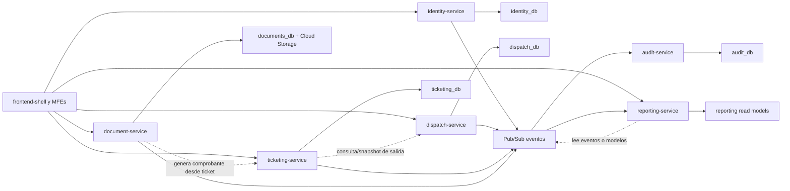

# Dia 5 - Definicion de dominios y limites de microservicios

Fecha: 2026-09-01
Fuentes: `tareas.md`, inventario VB6 y analisis de `usuario.mdb`

## Objetivo

Definir que responsabilidad pertenece a cada microservicio, que datos son fuente de verdad en cada dominio y que reglas evitan acoplamiento entre bases.

## Mapa de dominios



## Limites por servicio

### identity-service

Duenio de:

- Usuarios internos del sistema.
- Identidades locales.
- Vinculaciones con Google OIDC.
- Hashes de contrasena local.
- Estados de usuario: activo, suspendido, bloqueado, retirado.
- Roles, permisos y asignaciones.
- Correos, dominios o sujetos Google autorizados.
- Tokens de activacion, recuperacion y cambio de contrasena local.
- Registro tecnico de intentos de acceso necesario para seguridad inmediata.

No es duenio de:

- Pasajeros/clientes de boleteria.
- Terminales, buses, salidas o asientos.
- Ventas, boletos, anulaciones o comprobantes.
- Reportes operativos consolidados.

Decisiones:

- `Usuarios` de Access migra a este dominio, pero `Password` no se acepta como credencial valida en la plataforma nueva.
- Los demas servicios referencian operadores por `user_id` interno, sin copiar credenciales ni roles completos.
- Toda modificacion de rol, estado o credencial debe emitir evento auditable.

### dispatch-service

Duenio de:

- Terminales.
- Rutas.
- Tipos de bus.
- Buses.
- Layouts de asientos por bus o tipo de bus.
- Salidas programadas.
- Cancelacion o reprogramacion de salidas.

No es duenio de:

- Reservas, ventas, anulaciones o cobros.
- Disponibilidad transaccional de asientos por salida.
- Pasajeros.
- PDFs o documentos generados.
- Auditoria historica central.

Decisiones:

- `Terminales`, `Tipobus`, `Buses` y `Salidas` de Access migran a este dominio como datos maestros operativos.
- `Buses.Asientos` debe transformarse en layout verificable; el layout base inicial sera de 25 asientos por compatibilidad con VB6.
- Una salida publicada puede ser consultada o replicada por `ticketing-service`, pero solo `dispatch-service` la modifica.

### ticketing-service

Duenio de:

- Pasajeros usados en venta.
- Disponibilidad de asientos por salida.
- Reservas temporales.
- Boletos/tickets vendidos.
- Anulaciones de boletos.
- Reimpresiones solicitadas desde el flujo de venta.
- Reglas contra doble venta.
- Snapshots de datos de salida usados para conservar el comprobante historico.

No es duenio de:

- Catalogo maestro de buses, terminales o tipos de bus.
- Administracion de usuarios y permisos.
- Plantillas finales de PDF.
- Reportes agregados de largo plazo.

Decisiones:

- `Clientes` de Access se separa en pasajero + boleto + datos de venta.
- La disponibilidad real nace de `ticketing-service`, no del estado visual del frontend.
- Debe existir restriccion unica transaccional para impedir dos ventas activas sobre la misma combinacion `departure_id + seat_number`.
- El servicio puede guardar snapshot de bus, ruta, fecha, hora, precio y asiento al momento de venta para preservar historia aunque cambie el catalogo.

### document-service

Duenio de:

- Plantillas imprimibles.
- Metadata de documentos generados.
- Generacion de PDF de boleto.
- Rutas de almacenamiento en Cloud Storage.
- URLs firmadas o mecanismos seguros de descarga.

No es duenio de:

- Estado de venta o anulacion.
- Datos maestros de bus/salida.
- Identidades o permisos.
- Reportes analiticos.

Decisiones:

- `DrFacturacion` se recrea como plantilla de boleto/PDF.
- `DrClientes` puede apoyarse en reporting, pero la generacion/exportacion PDF queda en este servicio si se necesita archivo formal.
- El documento nunca decide si un boleto es valido; recibe datos de ticketing o reporting.

### reporting-service

Duenio de:

- Modelos de lectura para reportes.
- Consultas por fecha, usuario, ruta, bus, terminal y salida.
- Exportaciones CSV/PDF solicitadas por reportes.
- Agregados operativos y vistas materializadas.

No es duenio de:

- Escritura transaccional de ventas.
- Modificacion de catalogos.
- Autenticacion.
- Auditoria inmutable.

Decisiones:

- Puede duplicar datos desde eventos o APIs de lectura, pero sus tablas no son fuente de verdad operacional.
- `ClientesForm` y `DrClientes` migran funcionalmente a este dominio.
- Si un reporte necesita dato sensible, debe respetar permisos del usuario autenticado y minimizacion de PII.

### audit-service

Duenio de:

- Bitacora funcional inmutable.
- Eventos de seguridad.
- Eventos de cambios criticos.
- Registro de anulaciones, cambios de tarifa, cambios de rol, cambios de salida y acciones administrativas.
- Idempotencia de eventos auditados.

No es duenio de:

- Reglas de negocio que autorizan una venta.
- Estados maestros de usuarios, buses, salidas o boletos.
- PDFs.
- Reportes operativos comunes.

Decisiones:

- Consume eventos emitidos por los demas servicios.
- La auditoria debe ser append-only; correcciones se registran como nuevos eventos compensatorios.
- Debe permitir busquedas por `correlation_id`, usuario, recurso, accion y fecha.

## Matriz servicio-datos

| Servicio | Base objetivo | Datos fuente de verdad | Datos que puede leer o replicar | Escritura permitida |
| --- | --- | --- | --- | --- |
| `identity-service` | `identity_db` | Usuarios internos, credenciales locales, identidades Google, roles, permisos, autorizaciones | Ninguno sensible desde otros dominios; solo contexto minimo para auditoria de acceso | Solo `identity_db` |
| `dispatch-service` | `dispatch_db` | Terminales, rutas, tipos de bus, buses, layouts, salidas | IDs de usuario para auditoria de quien creo o modifico | Solo `dispatch_db` |
| `ticketing-service` | `ticketing_db` | Pasajeros, disponibilidad por salida/asiento, reservas, boletos, anulaciones | Snapshot de salidas, buses, rutas y terminales; ID de operador | Solo `ticketing_db` |
| `document-service` | `documents_db` + Cloud Storage | Plantillas, documentos generados, metadata documental, rutas de archivos | Snapshot de boleto, pasajero, venta y salida enviado por ticketing/reporting | Solo `documents_db` y bucket propio |
| `reporting-service` | `reporting_db` o BigQuery | Modelos de lectura, agregados y exportaciones de reporte | Eventos y snapshots de identity, dispatch, ticketing y documents | Solo modelos de lectura propios |
| `audit-service` | `audit_db` | Eventos auditables inmutables y metadatos de auditoria | Eventos de todos los servicios | Solo `audit_db` |

## Matriz de migracion desde Access

| Tabla/artefacto legacy | Dominio dueno nuevo | Transformacion principal |
| --- | --- | --- |
| `Usuarios` | `identity-service` | Crear usuarios internos; descartar password como credencial activa; generar flujo de activacion o reseteo. |
| `Terminales` | `dispatch-service` | Migrar terminales con `legacy_id`, datos de contacto y fecha de registro. |
| `Tipobus` | `dispatch-service` | Migrar tipos de bus y asociarlos a layouts. |
| `Buses` | `dispatch-service` | Migrar buses, matricula, tipo, terminal y layout de asientos. |
| `Salidas` | `dispatch-service` | Migrar salidas programadas; normalizar fecha/hora y relacionar con bus/ruta. |
| `Clientes` | `ticketing-service` | Separar pasajero, boleto, asiento vendido, precio y snapshot de salida. |
| `DrFacturacion` | `document-service` | Rehacer como plantilla PDF de boleto. |
| `DrClientes` | `reporting-service` + `document-service` | Rehacer como reporte consultable y exportable. |
| Imagenes legacy | `frontend-shell`/MFEs | Reutilizar solo activos utiles; no preservar estilos obsoletos por obligacion. |

## Reglas de propiedad de datos

- Cada microservicio escribe solamente en su propia base o almacenamiento.
- Ningun servicio crea claves foraneas directas hacia la base de otro servicio.
- Las referencias entre dominios se hacen por identificadores estables, preferentemente UUID.
- Durante migracion se conservara `legacy_id` por tabla origen para trazabilidad.
- Los modelos de lectura pueden duplicar datos, pero no son fuente de verdad.
- Las modificaciones de datos maestros se hacen mediante API del servicio dueno.
- Los eventos deben incluir `event_id`, `event_type`, `schema_version`, `occurred_at`, `source_service` y `correlation_id`.
- Los consumidores de eventos deben ser idempotentes.
- Las operaciones de venta y anulacion deben tener transaccion local en `ticketing-service`.
- La doble venta se evita en base de datos, no solo en validacion de frontend.
- La informacion personal se limita al dominio que la necesita: usuarios internos en identity, pasajeros en ticketing y vistas controladas en reporting.
- Auditoria no reemplaza a logs tecnicos; ambos deben existir.

## Contratos entre servicios

| Interaccion | Tipo recomendado | Regla |
| --- | --- | --- |
| Shell/MFEs -> servicios | REST HTTPS | Cada MFE consume APIs del dominio correspondiente usando token validado. |
| Ticketing -> Dispatch | REST o read model | Ticketing consulta salida/layout o consume eventos de salidas publicadas. |
| Ticketing -> Document | REST/comando asincrono | Ticketing solicita generar comprobante despues de venta confirmada. |
| Servicios -> Audit | Evento Pub/Sub | Cambios criticos se auditan por evento idempotente. |
| Servicios -> Reporting | Evento Pub/Sub | Reporting actualiza modelos de lectura sin escribir en bases transaccionales. |
| Identity -> demas servicios | JWT/claims | Los demas servicios validan identidad y permisos, sin acceder a credenciales. |

## Decisiones abiertas

- Definir si `ticketing-service` consultara `dispatch-service` en tiempo real o mantendra read model propio para salidas publicadas.
- Definir si `reporting-service` usara PostgreSQL inicialmente o BigQuery desde el primer despliegue.
- Definir politica de retencion de auditoria y documentos.
- Confirmar reglas comerciales de anulacion, reimpresion, cambio de asiento y reserva temporal.

## Criterio de avance

Cumplido:

- Limites de `identity-service` definidos.
- Limites de `dispatch-service` definidos.
- Limites de `ticketing-service` definidos.
- Limites de `document-service` definidos.
- Limites de `reporting-service` definidos.
- Limites de `audit-service` definidos.
- Reglas de propiedad de datos definidas.
- Mapa de dominios incluido.
- Matriz servicio-datos incluida.

Pendiente recomendado:

- Dia 6: convertir estos limites en contratos OpenAPI iniciales.

## Reversa primero

> Estandarizacion documental agregada el 2026-09-16 para que este dia tambien tenga una ruta segura de limpieza antes de repetir la practica.

Este dia pertenece a la etapa inicial del proyecto. Antes de ejecutar una reversa, revisar si el archivo contiene recursos externos reales, como Google Cloud, Docker, bases de datos o imagenes publicadas. No ejecutar comandos destructivos si no estas seguro de que el recurso no esta siendo usado.

### Paso R1 - Ubicarse en el workspace

```powershell
cd C:\VENTA-DE-PASAJES
```

### Paso R2 - Revisar recursos o archivos mencionados

```powershell
Select-String -Path .\docs\dia-05-definicion-dominios-microservicios.md -Pattern "C:\\VENTA-DE-PASAJES|docker|gcloud|mvn|npm|Remove-Item|delete|rm|Cloud SQL|Artifact Registry|Secret Manager" -Context 0,2
```

### Paso R3 - Detener procesos locales si este dia levanto herramientas

```powershell
Get-NetTCPConnection -LocalPort 3000,3001,3002,3003,8081,8082,8083,18083,18089,18096 -ErrorAction SilentlyContinue |
  Select-Object LocalAddress,LocalPort,State,OwningProcess |
  Format-Table -AutoSize

Get-CimInstance Win32_Process -Filter "name = 'java.exe' or name = 'node.exe'" |
  Select-Object ProcessId,CommandLine |
  Format-List
```

Si identificas un proceso propio de la practica, detenerlo:

```powershell
Stop-Process -Id <process-id> -Force
```

### Paso R4 - Revisar contenedores temporales

```powershell
docker ps -a --format "table {{.Names}}\t{{.Image}}\t{{.Status}}\t{{.Ports}}" |
  Select-String -Pattern "venta-pasajes|identity|dispatch|ticketing|native|postgres"
```

Si el contenedor fue creado solo para repetir este dia y no se usa en otra practica:

```powershell
docker rm -f <container-name>
```

### Paso R5 - Reversa de archivos locales

La reversa de archivos debe hacerse con control de cambios o backup. Este workspace inicio sin Git en los primeros dias, por eso no se recomienda borrar archivos a ciegas.

```powershell
Select-String -Path .\docs\dia-05-definicion-dominios-microservicios.md -Pattern "Archivo|Archivos|C:\\VENTA-DE-PASAJES" -Context 0,4
```

Si aun asi necesitas retirar solo este documento de la practica, hacer primero una copia:

```powershell
New-Item -ItemType Directory -Force -Path .\backups | Out-Null
Copy-Item -LiteralPath .\docs\dia-05-definicion-dominios-microservicios.md -Destination .\backups\dia-05-definicion-dominios-microservicios-manual-backup.md -Force
```

Despues de respaldar, se podria eliminar manualmente el documento con:

```powershell
Remove-Item -LiteralPath .\docs\dia-05-definicion-dominios-microservicios.md -Force
```

## Guia manual desde cero

> Estandarizacion documental agregada el 2026-09-16. Esta guia permite repetir el dia sin depender de Codex, usando el documento como fuente de verdad.

### Paso 1 - Ubicarse en el proyecto

```powershell
cd C:\VENTA-DE-PASAJES
```

### Paso 2 - Leer el alcance del dia en el backlog

```powershell
Select-String -Path .\tareas.md -Pattern "Dia 5|Dia 05" -Context 0,40
```

### Paso 3 - Leer la documentacion del dia

```powershell
Get-Content -LiteralPath .\docs\dia-05-definicion-dominios-microservicios.md
```

### Paso 4 - Verificar archivos y rutas mencionadas

```powershell
Select-String -Path .\docs\dia-05-definicion-dominios-microservicios.md -Pattern "C:\\VENTA-DE-PASAJES" -AllMatches
```

Para cada ruta importante que aparezca en el documento:

```powershell
Test-Path -LiteralPath "<ruta-copiada-del-documento>"
```

### Paso 5 - Ejecutar comandos documentados

Buscar bloques de comandos del documento y ejecutarlos en orden, validando el resultado de cada bloque antes de continuar:

```powershell
Select-String -Path .\docs\dia-05-definicion-dominios-microservicios.md -Pattern "```powershell|```text|mvn |npm |docker |gcloud |curl.exe|powershell " -Context 0,6
```

### Paso 6 - Registrar la repeticion en bitacora

```powershell
Add-Content -LiteralPath .\vitacora.md -Value "`nReplica manual Dia 5 - <fecha>: comandos ejecutados y resultado."
```

### Paso 7 - Validar criterio de avance

Revisar la seccion de criterio de avance, resultado, estado final o pendientes del documento:

```powershell
Select-String -Path .\docs\dia-05-definicion-dominios-microservicios.md -Pattern "Criterio de avance|Resultado|Estado final|Pendiente|Pendientes" -Context 0,8
```
