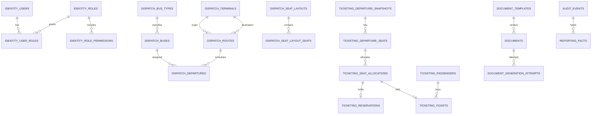

# Dia 8 - Diseno de modelo PostgreSQL por servicio

Fecha: 2026-09-01
Fuentes: analisis Access del Dia 4, limites de dominio del Dia 5, contratos API del Dia 6 y eventos del Dia 7.

## Objetivo

Disenar el modelo PostgreSQL inicial por microservicio, con bases separadas, reglas de integridad y soporte para migracion desde Access.

## Archivos DDL generados

| Base | Servicio dueno | Archivo |
| --- | --- | --- |
| `identity_db` | `identity-service` | `C:\VENTA-DE-PASAJES\docs\database\identity-db.sql` |
| `dispatch_db` | `dispatch-service` | `C:\VENTA-DE-PASAJES\docs\database\dispatch-db.sql` |
| `ticketing_db` | `ticketing-service` | `C:\VENTA-DE-PASAJES\docs\database\ticketing-db.sql` |
| `documents_db` | `document-service` | `C:\VENTA-DE-PASAJES\docs\database\documents-db.sql` |
| `reporting_db` | `reporting-service` | `C:\VENTA-DE-PASAJES\docs\database\reporting-db.sql` |
| `audit_db` | `audit-service` | `C:\VENTA-DE-PASAJES\docs\database\audit-db.sql` |

## Modelo general



El diagrama muestra relaciones conceptuales. No implica claves foraneas entre bases de distintos microservicios.

## identity_db

Tablas:

- `users`: usuarios internos, identidad local/Google/hibrida, estado y trazabilidad legacy.
- `local_credentials`: hash de contrasena local, algoritmo y bandera de cambio obligatorio.
- `google_identities`: vinculacion con `google_subject` y correo verificado.
- `internal_profiles`: datos operativos del perfil interno del usuario.
- `roles`: roles funcionales.
- `permissions`: permisos funcionales.
- `role_permissions`: relacion rol-permiso.
- `user_roles`: asignacion de roles a usuarios.
- `authorized_identities`: correos, dominios o sujetos Google autorizados.
- `password_reset_tokens`: activacion y recuperacion de contrasena.
- `login_attempts`: intentos de acceso.
- `outbox_events`: eventos producidos por identidad.

Reglas principales:

- `users.login` es unico.
- `users.email` y `users.google_subject` son unicos cuando existen.
- `legacy_id` permite trazar `Usuarios.Id_usuario`.
- `local_credentials.password_hash` puede ser nulo para usuarios migrados pendientes de activacion.
- Passwords legacy no se migran como credencial activa.
- Roles y permisos se resuelven solo dentro de `identity_db`.

## dispatch_db

Tablas:

- `terminals`: terminales migradas desde Access.
- `routes`: rutas entre terminal origen y destino.
- `bus_types`: tipos de bus.
- `seat_layouts`: layouts de asientos.
- `seat_layout_seats`: definicion de asientos por layout.
- `buses`: buses, matricula, tipo, terminal y layout.
- `departures`: salidas programadas.
- `outbox_events`: eventos producidos por despacho.

Reglas principales:

- `terminals.name` es unico.
- `routes` exige origen y destino diferentes.
- `routes` evita duplicar la misma pareja origen-destino.
- `bus_types.name` es unico.
- `seat_layout_seats` evita duplicar numero de asiento por layout.
- `buses.code` moderniza `Buses.Id_Bus` y es unico.
- `buses.plate` moderniza `Buses.Matricula` y es unico.
- `departures` evita duplicar el mismo bus en la misma hora activa mediante indice unico parcial.
- `departures` guarda cancelacion con `cancelled_at` obligatorio si el estado es `CANCELLED`.

## ticketing_db

Tablas:

- `dispatch_departure_snapshots`: copia controlada de salidas publicadas por `dispatch-service`.
- `departure_seats`: asientos disponibles por salida.
- `passengers`: pasajeros/clientes de venta.
- `passenger_legacy_mappings`: relacion entre pasajeros deduplicados y registros legacy de `Clientes`.
- `seat_allocations`: asignacion transaccional de asiento.
- `reservations`: reserva temporal.
- `tickets`: boleto vendido o anulado.
- `ticket_document_refs`: referencia a documentos generados por `document-service`.
- `idempotency_keys`: idempotencia de venta/anulacion.
- `processed_events`: eventos consumidos desde dispatch/documents.
- `outbox_events`: eventos producidos por ticketing.

Reglas principales:

- `dispatch_departure_snapshots` no reemplaza a `dispatch_db`; es un read model local para venta.
- `passengers` deduplica por `document_type + document_number`.
- `seat_allocations` tiene indice unico parcial sobre `departure_id + seat_number` cuando el estado es `RESERVED` o `SOLD`.
- Esa restriccion es la defensa principal contra doble venta.
- `reservations` referencia el asiento de la salida y expira por `expires_at`.
- `tickets` referencia `seat_allocations`, `passengers` y el asiento de salida.
- `tickets.ticket_number` es unico.
- `tickets.legacy_id` permite trazar registros legacy de `Clientes`.
- `tickets.departure_snapshot` conserva datos historicos de bus, ruta, origen, destino y hora aunque cambie dispatch.
- Una anulacion exige `cancelled_at`, `cancelled_by_user_id` y `cancellation_reason`.

## documents_db

Tablas:

- `document_templates`: plantillas de boletos y reportes.
- `documents`: metadata de PDFs u otros documentos generados.
- `document_generation_attempts`: intentos de generacion.
- `idempotency_keys`: idempotencia de generacion.
- `processed_events`: eventos consumidos desde ticketing/reporting.
- `outbox_events`: eventos producidos por documents.

Reglas principales:

- Solo una plantilla activa por `type + code`.
- Solo un documento por `owner_type + owner_id + type`, salvo que se cree una version futura explicita.
- `storage_uri` apunta a Cloud Storage.
- El documento no decide estado de boleto; solo registra generacion y almacenamiento.

## reporting_db

Tablas:

- `dim_users`: usuarios operativos minimos para reportes.
- `dim_terminals`: terminales.
- `dim_routes`: rutas.
- `dim_buses`: buses.
- `dim_departures`: salidas.
- `fact_ticket_sales`: ventas y anulaciones.
- `fact_documents`: estado de documentos.
- `report_export_jobs`: solicitudes de exportacion.
- `idempotency_keys`: idempotencia de exportaciones.
- `processed_events`: eventos consumidos desde otros servicios.
- `outbox_events`: eventos producidos por reporting si aplica.

Reglas principales:

- Reporting es eventualmente consistente.
- Sus tablas son modelos de lectura, no fuente de verdad transaccional.
- No hay claves foraneas a bases de otros servicios.
- `fact_ticket_sales` conserva snapshots suficientes para reportes por fecha, usuario, bus, terminal y ruta.
- Los datos personales de pasajeros se limitan al minimo necesario para reportes operativos.

## audit_db

Tablas:

- `audit_events`: auditoria funcional inmutable.
- `processed_events`: eventos consumidos e idempotencia.
- `outbox_events`: eventos producidos por auditoria si se requiere alimentar reporting.

Reglas principales:

- `audit_events` es append-only a nivel funcional.
- `source_service + source_event_id` es unico para no auditar dos veces el mismo evento.
- Se indexa por fecha, usuario, recurso y `correlation_id`.
- Correcciones se registran como nuevos eventos, no sobrescribiendo historia.

## Tablas de soporte comunes

### outbox_events

Presente en servicios productores.

Uso:

- Guardar eventos dentro de la misma transaccion local del cambio de negocio.
- Publicar a Pub/Sub de forma confiable despues del commit.
- Reintentar publicacion sin cambiar `event_id`.

Campos clave:

- `event_id`
- `event_type`
- `schema_version`
- `source_service`
- `correlation_id`
- `payload`
- `status`
- `attempts`
- `next_attempt_at`
- `published_at`

### processed_events

Presente en servicios consumidores.

Uso:

- Registrar eventos ya procesados.
- Evitar efectos duplicados ante redelivery de Pub/Sub.

Clave unica:

`source_service + event_id + consumer_name`

## Reglas de integridad global

- Ninguna base tiene claves foraneas hacia tablas de otra base.
- Cada servicio escribe solo en su propia base.
- Cada tabla migrada desde Access conserva trazabilidad mediante `legacy_id` o tabla de mapeo.
- Las restricciones de negocio criticas viven en PostgreSQL, no solo en frontend.
- Estados se restringen con `CHECK`.
- Datos monetarios usan `numeric(12, 2)`.
- Fechas operativas usan `timestamptz`.
- Correos/login usan `citext` donde aplica para evitar duplicados por mayusculas/minusculas.
- Datos flexibles de evento o snapshot usan `jsonb`.

## Transformaciones desde Access

| Access | PostgreSQL destino | Regla |
| --- | --- | --- |
| `Usuarios` | `identity_db.users`, `local_credentials` | Migrar usuario con `legacy_id`; no migrar `Password` como password activo. |
| `Terminales` | `dispatch_db.terminals` | Migrar `Id` como `legacy_id`; `ID_local` como `local_code`. |
| `Tipobus` | `dispatch_db.bus_types` | Migrar tipo con `legacy_id`. |
| `Buses` | `dispatch_db.buses` | Migrar `Id_Bus` como `code`, `Matricula` como `plate`, `Tipo` y `terminal` como referencias internas de dispatch. |
| `Buses.Asientos` | `dispatch_db.seat_layouts`, `seat_layout_seats` | Crear layout de 25 asientos inicial si aplica. |
| `Salidas` | `dispatch_db.departures` | Normalizar `Hora_salida` + `Fecha_salida` hacia `departure_at`. |
| `Clientes` | `ticketing_db.passengers`, `tickets`, `passenger_legacy_mappings` | Separar pasajero, boleto, precio, asiento y snapshot de salida. |
| `Clientes.Precio` | `tickets.price` | Convertir texto numerico a `numeric(12, 2)`. |
| `Clientes.H_salida`/`H_registro` | `tickets.departure_snapshot`, `tickets.sold_at` | Normalizar horas; requieren regla especial porque no pasaron `IsDate` en Access. |

## Decisiones abiertas

- Confirmar moneda final (`PEN` por compatibilidad con comprobantes legacy en soles).
- Confirmar reglas de reserva temporal: duracion, extension y liberacion.
- Confirmar politica de anulacion y devolucion.
- Confirmar si reporting inicia en PostgreSQL o BigQuery.
- Definir triggers o estrategia ORM para mantener `updated_at`.
- Definir particionamiento futuro para `audit_events` y `fact_ticket_sales` si el volumen crece.

## Criterio de avance

Cumplido:

- `identity_db` disenado.
- `dispatch_db` disenado.
- `ticketing_db` disenado.
- `documents_db` disenado.
- `audit_db` disenado.
- Modelos de lectura para reporting disenados.
- Reglas de integridad documentadas.

Pendiente recomendado:

- Dia 9: preparar estructura del monorepo.
- Dia 16 en adelante: convertir estos DDL en migraciones versionadas por servicio.

## Reversa primero

> Estandarizacion documental agregada el 2026-09-16 para que este dia tambien tenga una ruta segura de limpieza antes de repetir la practica.

Este dia pertenece a la etapa inicial del proyecto. Antes de ejecutar una reversa, revisar si el archivo contiene recursos externos reales, como Google Cloud, Docker, bases de datos o imagenes publicadas. No ejecutar comandos destructivos si no estas seguro de que el recurso no esta siendo usado.

### Paso R1 - Ubicarse en el workspace

```powershell
cd C:\VENTA-DE-PASAJES
```

### Paso R2 - Revisar recursos o archivos mencionados

```powershell
Select-String -Path .\docs\dia-08-diseno-modelo-postgresql.md -Pattern "C:\\VENTA-DE-PASAJES|docker|gcloud|mvn|npm|Remove-Item|delete|rm|Cloud SQL|Artifact Registry|Secret Manager" -Context 0,2
```

### Paso R3 - Detener procesos locales si este dia levanto herramientas

```powershell
Get-NetTCPConnection -LocalPort 3000,3001,3002,3003,8081,8082,8083,18083,18089,18096 -ErrorAction SilentlyContinue |
  Select-Object LocalAddress,LocalPort,State,OwningProcess |
  Format-Table -AutoSize

Get-CimInstance Win32_Process -Filter "name = 'java.exe' or name = 'node.exe'" |
  Select-Object ProcessId,CommandLine |
  Format-List
```

Si identificas un proceso propio de la practica, detenerlo:

```powershell
Stop-Process -Id <process-id> -Force
```

### Paso R4 - Revisar contenedores temporales

```powershell
docker ps -a --format "table {{.Names}}\t{{.Image}}\t{{.Status}}\t{{.Ports}}" |
  Select-String -Pattern "venta-pasajes|identity|dispatch|ticketing|native|postgres"
```

Si el contenedor fue creado solo para repetir este dia y no se usa en otra practica:

```powershell
docker rm -f <container-name>
```

### Paso R5 - Reversa de archivos locales

La reversa de archivos debe hacerse con control de cambios o backup. Este workspace inicio sin Git en los primeros dias, por eso no se recomienda borrar archivos a ciegas.

```powershell
Select-String -Path .\docs\dia-08-diseno-modelo-postgresql.md -Pattern "Archivo|Archivos|C:\\VENTA-DE-PASAJES" -Context 0,4
```

Si aun asi necesitas retirar solo este documento de la practica, hacer primero una copia:

```powershell
New-Item -ItemType Directory -Force -Path .\backups | Out-Null
Copy-Item -LiteralPath .\docs\dia-08-diseno-modelo-postgresql.md -Destination .\backups\dia-08-diseno-modelo-postgresql-manual-backup.md -Force
```

Despues de respaldar, se podria eliminar manualmente el documento con:

```powershell
Remove-Item -LiteralPath .\docs\dia-08-diseno-modelo-postgresql.md -Force
```

## Guia manual desde cero

> Estandarizacion documental agregada el 2026-09-16. Esta guia permite repetir el dia sin depender de Codex, usando el documento como fuente de verdad.

### Paso 1 - Ubicarse en el proyecto

```powershell
cd C:\VENTA-DE-PASAJES
```

### Paso 2 - Leer el alcance del dia en el backlog

```powershell
Select-String -Path .\tareas.md -Pattern "Dia 8|Dia 08" -Context 0,40
```

### Paso 3 - Leer la documentacion del dia

```powershell
Get-Content -LiteralPath .\docs\dia-08-diseno-modelo-postgresql.md
```

### Paso 4 - Verificar archivos y rutas mencionadas

```powershell
Select-String -Path .\docs\dia-08-diseno-modelo-postgresql.md -Pattern "C:\\VENTA-DE-PASAJES" -AllMatches
```

Para cada ruta importante que aparezca en el documento:

```powershell
Test-Path -LiteralPath "<ruta-copiada-del-documento>"
```

### Paso 5 - Ejecutar comandos documentados

Buscar bloques de comandos del documento y ejecutarlos en orden, validando el resultado de cada bloque antes de continuar:

```powershell
Select-String -Path .\docs\dia-08-diseno-modelo-postgresql.md -Pattern "```powershell|```text|mvn |npm |docker |gcloud |curl.exe|powershell " -Context 0,6
```

### Paso 6 - Registrar la repeticion en bitacora

```powershell
Add-Content -LiteralPath .\vitacora.md -Value "`nReplica manual Dia 8 - <fecha>: comandos ejecutados y resultado."
```

### Paso 7 - Validar criterio de avance

Revisar la seccion de criterio de avance, resultado, estado final o pendientes del documento:

```powershell
Select-String -Path .\docs\dia-08-diseno-modelo-postgresql.md -Pattern "Criterio de avance|Resultado|Estado final|Pendiente|Pendientes" -Context 0,8
```
