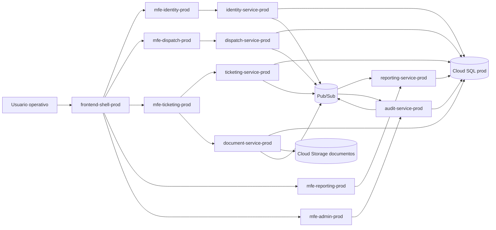
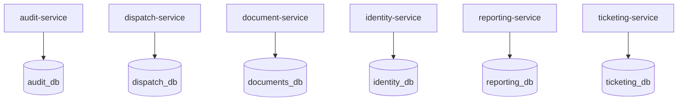
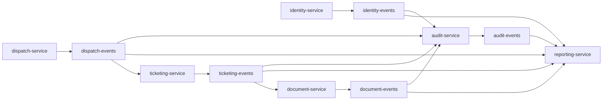
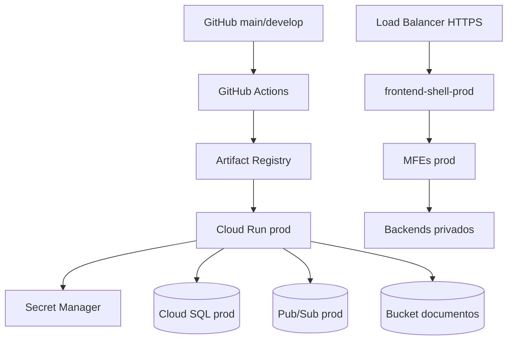

# Diagramas finales

Fecha base: 2026-09-29

Los diagramas estan en Mermaid para poder versionarlos en Git y actualizarlos junto con el codigo.

## Vista general

## Microservicios y bases

## Eventos principales

## Despliegue productivo

