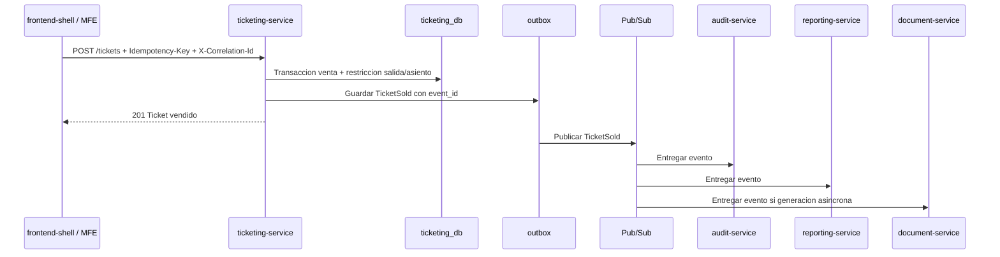

# Diseno Pub/Sub

Fecha: 2026-09-01
Aplicacion: Sistema de Venta de Pasajes

## Objetivo

Definir topicos, suscripciones, convenciones de `correlation_id`, politicas de idempotencia y reglas operativas para mensajeria asincrona en Google Cloud Pub/Sub.

## Principios

- Pub/Sub transporta hechos de dominio ya confirmados.
- La base transaccional del servicio origen sigue siendo la fuente de verdad.
- Los eventos se publican despues de confirmar la transaccion local.
- Cada consumidor procesa eventos de forma idempotente.
- La auditoria consume eventos, pero no reemplaza las tablas transaccionales.
- Reporting puede duplicar datos en modelos de lectura sin convertirse en dueno.

## Topicos iniciales

| Topic | Productor | Tipo de eventos |
| --- | --- | --- |
| `venta-pasajes-{env}-identity-events` | `identity-service` | Usuarios, roles, permisos y seguridad de identidad. |
| `venta-pasajes-{env}-dispatch-events` | `dispatch-service` | Terminales, buses, layouts y salidas. |
| `venta-pasajes-{env}-ticketing-events` | `ticketing-service` | Reservas, ventas, anulaciones e impresiones. |
| `venta-pasajes-{env}-document-events` | `document-service` | Documentos generados o fallidos. |
| `venta-pasajes-{env}-audit-events` | `audit-service` | Eventos internos de auditoria si se requieren tableros o integraciones. |

`{env}` debe ser uno de:

- `dev`
- `test`
- `staging`
- `prod`

## Suscripciones iniciales

| Suscripcion | Topic origen | Consumidor | Proposito |
| --- | --- | --- | --- |
| `venta-pasajes-{env}-audit-identity-events-sub` | identity | `audit-service` | Auditar altas, cambios de rol y eventos de seguridad. |
| `venta-pasajes-{env}-audit-dispatch-events-sub` | dispatch | `audit-service` | Auditar cambios de terminales, buses, layouts y salidas. |
| `venta-pasajes-{env}-audit-ticketing-events-sub` | ticketing | `audit-service` | Auditar reservas, ventas, anulaciones e impresiones. |
| `venta-pasajes-{env}-audit-document-events-sub` | document | `audit-service` | Auditar generacion de documentos. |
| `venta-pasajes-{env}-reporting-identity-events-sub` | identity | `reporting-service` | Mantener nombres/estados operativos minimos de vendedores si aplica. |
| `venta-pasajes-{env}-reporting-dispatch-events-sub` | dispatch | `reporting-service` | Mantener dimensiones de terminales, rutas, buses y salidas. |
| `venta-pasajes-{env}-reporting-ticketing-events-sub` | ticketing | `reporting-service` | Mantener ventas, anulaciones y ocupacion historica. |
| `venta-pasajes-{env}-reporting-document-events-sub` | document | `reporting-service` | Mantener estado de comprobantes/exportaciones. |
| `venta-pasajes-{env}-ticketing-dispatch-events-sub` | dispatch | `ticketing-service` | Mantener read model de salidas/layouts si se decide no consultar dispatch en tiempo real. |
| `venta-pasajes-{env}-document-ticketing-events-sub` | ticketing | `document-service` | Generar comprobante automaticamente tras `TicketSold` si se elige flujo asincrono. |

La generacion de comprobante puede iniciar por REST desde `ticketing-service` o por evento `TicketSold`. La decision final queda abierta hasta implementar el flujo de venta.

## Dead-letter topics

| Topic principal | Dead-letter topic |
| --- | --- |
| `venta-pasajes-{env}-identity-events` | `venta-pasajes-{env}-identity-events-dlq` |
| `venta-pasajes-{env}-dispatch-events` | `venta-pasajes-{env}-dispatch-events-dlq` |
| `venta-pasajes-{env}-ticketing-events` | `venta-pasajes-{env}-ticketing-events-dlq` |
| `venta-pasajes-{env}-document-events` | `venta-pasajes-{env}-document-events-dlq` |
| `venta-pasajes-{env}-audit-events` | `venta-pasajes-{env}-audit-events-dlq` |

Politica inicial:

- Maximo de intentos: 10.
- Mensajes invalidos por contrato se envian a DLQ.
- Fallos temporales se reintentan con backoff.
- DLQ debe tener alerta en Cloud Monitoring.

## Atributos Pub/Sub

Cada mensaje debe publicar estos atributos para filtros y diagnostico:

| Atributo | Valor |
| --- | --- |
| `event_type` | Igual a `event_type` del cuerpo. |
| `schema_version` | Version del payload como texto. |
| `source_service` | Servicio origen. |
| `correlation_id` | UUID de correlacion. |
| `resource_type` | Recurso principal si aplica. |
| `resource_id` | ID del recurso principal si aplica. |
| `occurred_at` | Fecha/hora UTC del evento. |

El cuerpo del mensaje contiene el JSON completo del evento.

## Convencion de correlation_id

- Toda solicitud HTTP entrante acepta `X-Correlation-Id`.
- Si no llega, el gateway o primer servicio genera un UUID.
- El mismo `correlation_id` se propaga a:
  - Logs estructurados.
  - Llamadas REST internas.
  - Eventos Pub/Sub.
  - Respuestas HTTP.
- `correlation_id` representa la operacion completa.
- `event_id` identifica un hecho unico.
- `causation_id` identifica el evento/comando que causo otro evento.

Ejemplo:

- Venta HTTP recibe `X-Correlation-Id = A`.
- `ticketing-service` vende boleto y publica `TicketSold` con `correlation_id = A`.
- `document-service` genera PDF y publica `DocumentGenerated` con `correlation_id = A` y `causation_id = event_id` del `TicketSold`.
- `audit-service` registra ambos eventos con el mismo `correlation_id`.

## Politica de idempotencia

### Productores

- Cada evento se genera una sola vez por cambio de estado confirmado.
- El productor debe guardar evento en tabla outbox dentro de la misma transaccion del cambio de negocio.
- El publicador lee la outbox y publica a Pub/Sub.
- El evento conserva el mismo `event_id` aunque se reintente la publicacion.
- La outbox marca estados `PENDING`, `PUBLISHED` y `FAILED`.

### Consumidores

- Cada consumidor mantiene tabla `processed_events`.
- Clave unica recomendada: `source_service + event_id + consumer_name`.
- El consumidor registra el evento antes o durante la misma transaccion de sus efectos locales.
- Si el evento ya existe en `processed_events`, se confirma sin repetir efectos.
- Si el payload es de una `schema_version` no soportada, se envia a DLQ y se alerta.

### Operaciones con efectos externos

- Generacion de PDF usa `Idempotency-Key` o `event_id` del evento origen.
- Exportaciones usan `Idempotency-Key`.
- Reimpresiones registran evento, pero no duplican documento salvo decision explicita.

## Orden y consistencia

- No depender de orden global de Pub/Sub.
- Si se requiere orden por recurso, usar ordering key por `resource_type:resource_id`.
- Los consumidores deben soportar eventos tardios o repetidos.
- Reporting puede quedar eventualmente consistente.
- Ticketing no debe depender de reporting para vender.
- La venta y anulacion se resuelven con transaccion local en `ticketing-service`.

## Retencion inicial

- Retencion de mensajes en Pub/Sub: 7 dias en `dev/test`, 14 dias en `staging/prod`.
- Retencion DLQ: 30 dias.
- Retencion de auditoria en `audit_db`: pendiente de politica final; recomendacion inicial minima de 5 anios para eventos operativos criticos.

## Seguridad

- Cada servicio publicador tiene permiso `pubsub.publisher` solo sobre su topic.
- Cada servicio consumidor tiene permiso `pubsub.subscriber` solo sobre sus suscripciones.
- No publicar passwords, hashes, tokens, secretos ni documentos completos.
- Los datos personales en eventos se reducen a lo necesario para reportes y auditoria.
- Payloads sensibles deben revisarse antes de crear nuevas versiones.

## Observabilidad

Metricas minimas:

- Mensajes publicados por topic.
- Errores de publicacion.
- Edad maxima de mensajes pendientes por suscripcion.
- Intentos de entrega.
- Mensajes en DLQ.
- Tiempo de procesamiento por consumidor.

Alertas minimas:

- Mensajes en DLQ mayor a 0 en `prod`.
- Edad maxima de mensaje pendiente mayor a 5 minutos en consumidores criticos.
- Error rate de publicacion mayor a 1%.
- Caida de consumidores de audit o ticketing.

## Flujo inicial recomendado

## Decisiones abiertas

- Definir si `document-service` generara boleto por REST sincronico/asincrono o por consumo de `TicketSold`.
- Definir si `ticketing-service` mantendra read model de dispatch o consultara `dispatch-service` en tiempo real.
- Confirmar retencion legal/operativa de auditoria.
- Confirmar si reporting inicial se implementara en PostgreSQL o BigQuery.
