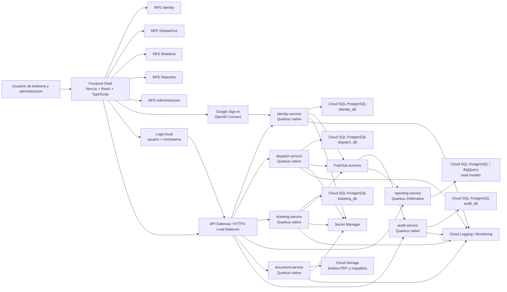
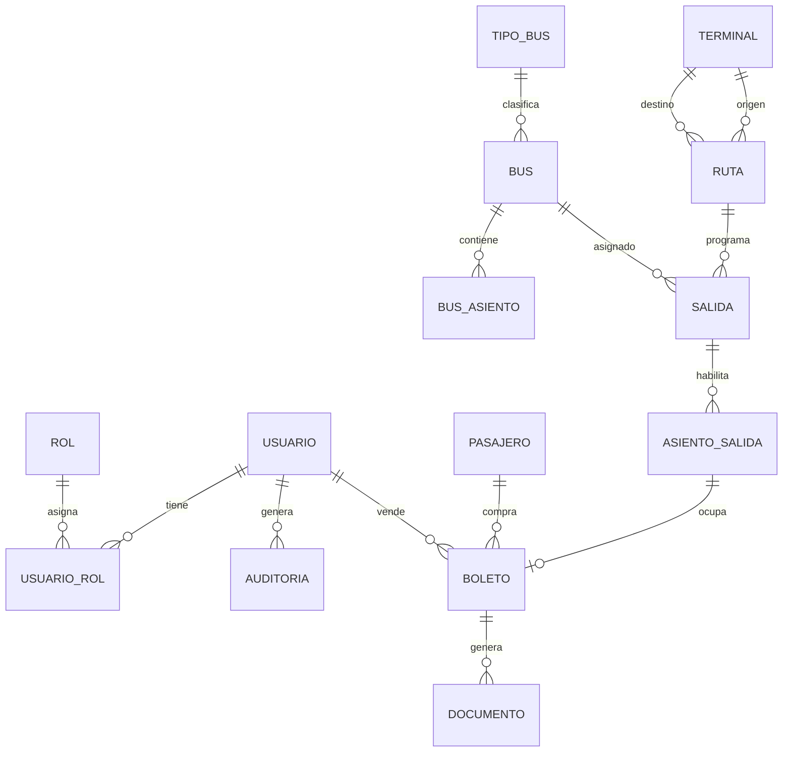

# Plan de trabajo: migracion del Sistema de Venta de Pasajes a Google Cloud con microservicios Quarkus nativos y microfrontends

Fecha: 2026-09-01

## Objetivo

Recrear y migrar el aplicativo actual de venta de pasajes, desarrollado en Visual Basic 6 con base de datos Access `usuario.mdb`, hacia una plataforma moderna en Google Cloud, orientada desde el inicio a crecimiento rapido por modulos.

La nueva plataforma usara:

- Backend basado en microservicios con Quarkus.
- Compilacion nativa con GraalVM/Mandrel para servicios criticos.
- Cloud Run como plataforma serverless para contenedores.
- Cloud SQL PostgreSQL como base transaccional.
- Pub/Sub y Cloud Tasks para procesos asincronos.
- Frontend con Next.js + React + TypeScript.
- Arquitectura de microfrontends, incluyendo un shell principal.
- Identidad hibrida: Sign in with Google mediante OpenID Connect y usuarios locales seguros.
- CI/CD automatizado con Cloud Build y Artifact Registry.
- Seguridad con IAM, Secret Manager en Google Cloud, proveedor alternativo de secretos para on-premise/offline, autenticacion centralizada y auditoria.

Nota transversal incorporada el 2026-09-02:

- El aplicativo tambien debe poder ejecutarse en ambiente on-premise/offline.
- Google Secret Manager es proveedor de secretos para runtimes GCP, no dependencia universal.
- En on-premise/offline se debe soportar variables de entorno, archivo local protegido, Docker/Kubernetes secrets o Vault equivalente.

El resultado esperado es un sistema funcionando en Google Cloud para operacion real de boleteria: usuarios, terminales, buses, salidas, asientos, venta de boletos, anulaciones, reportes, PDFs, respaldos, monitoreo y soporte.

## Alcance

Este plan se enfoca en migrar el aplicativo de venta de pasajes ubicado originalmente en:

```text
C:\Users\diego.martinezc\Downloads\Nueva carpeta (145)\SISTEMA DE VENTA DE PASAJES-20260901T151359Z-1-001\SISTEMA DE VENTA DE PASAJES
```

Archivo de plan actual:

```text
C:\VENTA-DE-PASAJES\tareas.md
```

No se incluye en esta version:

- Encomiendas.
- Facturacion electronica SRI completa.
- Pagos online.
- Contabilidad completa.
- Venta publica por internet para pasajeros.
- App movil nativa.

Estos modulos se dejan previstos para crecer posteriormente sobre la misma arquitectura.

## Sistema actual identificado

Tecnologia actual:

- Visual Basic 6.
- Formularios `.frm`.
- Reportes VB6 DataReport.
- Base de datos Microsoft Access `.mdb`.
- Controles antiguos `.ocx`.

Modulos actuales a recrear:

- Inicio de sesion con Google o usuario local.
- Registro y administracion de usuarios locales, perfiles internos, roles y permisos.
- Mantenimiento de buses.
- Gestion de terminales.
- Gestion de salidas.
- Venta de boletos.
- Seleccion de asientos.
- Registro de clientes/pasajeros.
- Reporte de clientes.
- Reporte o comprobante de boleto.

Tablas actuales detectadas:

- `Usuarios` como fuente historica; en la nueva plataforma se migrara a identidad hibrida.
- `Buses`.
- `Tipobus`.
- `Terminales`.
- `Salidas`.
- `Clientes`.

## Arquitectura objetivo



## Microservicios iniciales

### `identity-service`

Responsable de:

- Usuarios locales.
- Perfiles internos vinculados a cuentas Google.
- Roles.
- Permisos.
- Sesiones.
- Validacion de tokens OIDC de Google.
- Validacion de credenciales locales.
- Recuperacion y cambio de contrasena local.
- Lista de correos o dominios autorizados.
- Auditoria de accesos.

Persistencia:

- `identity_db`.

### `dispatch-service`

Responsable de:

- Terminales.
- Rutas.
- Tipos de bus.
- Buses.
- Programacion de salidas.
- Layouts de asientos por bus.

Persistencia:

- `dispatch_db`.

### `ticketing-service`

Responsable de:

- Disponibilidad de asientos.
- Reservas.
- Venta de boletos.
- Anulaciones.
- Liberacion de asientos.
- Reglas contra doble venta.

Persistencia:

- `ticketing_db`.

### `document-service`

Responsable de:

- Generacion de PDF de boleto.
- Plantillas imprimibles.
- Almacenamiento en Cloud Storage.
- URLs firmadas para descarga.

Persistencia:

- `documents_db` si se requiere metadata documental.
- Cloud Storage para archivos.

### `reporting-service`

Responsable de:

- Reportes operativos.
- Consultas por rango de fechas.
- Ventas por ruta, bus, terminal y usuario.
- Lectura de modelos de consulta.

Persistencia:

- Modelos de lectura en PostgreSQL o BigQuery.

### `audit-service`

Responsable de:

- Auditoria funcional.
- Anulaciones.
- Cambios de tarifa.
- Cambios de usuario.
- Eventos de seguridad.

Persistencia:

- `audit_db`.

## Microfrontends iniciales

### `frontend-shell`

Responsable de:

- Pantalla de entrada con Google y usuario local.
- Layout general.
- Menu principal.
- Navegacion entre modulos.
- Carga de microfrontends.
- Manejo de sesion y token.
- Guards de rutas por permisos.
- Tema visual y componentes base.

### `mfe-identity`

Pantallas:

- Registro de usuario local.
- Perfiles autorizados.
- Roles.
- Permisos.
- Perfil.
- Vinculacion de cuenta Google con rol operativo.
- Cambio y recuperacion de contrasena local.

### `mfe-dispatch`

Pantallas:

- Terminales.
- Rutas.
- Tipos de bus.
- Buses.
- Layouts de asientos.
- Salidas.

### `mfe-ticketing`

Pantallas:

- Busqueda de salidas.
- Mapa de asientos.
- Venta de boleto.
- Reserva temporal.
- Anulacion.
- Reimpresion de boleto.

### `mfe-reporting`

Pantallas:

- Ventas por fecha.
- Pasajeros por salida.
- Ventas por usuario.
- Ventas por bus/ruta.
- Exportacion CSV/PDF.

### `mfe-admin`

Pantallas:

- Parametros generales.
- Configuracion de impresion.
- Auditoria.
- Salud del sistema.
- Administracion de catalogos no criticos.

## Decisiones tecnicas obligatorias

- Cada microservicio Quarkus debe tener su propio paquete, configuracion y pipeline.
- Cada microservicio debe exponer contrato OpenAPI.
- Ningun microservicio debe escribir directamente en la base de otro.
- Cada microservicio debe tener su propio usuario de base de datos.
- Para iniciar se puede usar una sola instancia Cloud SQL con varias bases separadas.
- `ticketing-service` debe usar transacciones y restriccion unica para impedir doble venta.
- Los eventos criticos se publicaran en Pub/Sub.
- Los consumidores deben ser idempotentes.
- Se soportaran dos metodos de autenticacion: Sign in with Google y usuario local.
- Google Sign-In sera la opcion recomendada para cuentas corporativas o cuentas Google aceptadas por el usuario.
- El usuario local sera la alternativa para personas que no quieran asociar una cuenta Google personal.
- Las contrasenas locales nunca se guardaran en texto plano; se almacenaran como hash seguro.
- `identity-service` administrara usuarios locales, perfiles internos, roles, permisos, correos autorizados y vinculaciones Google.
- Si una persona sale de la organizacion, se debe retirar el acceso desde Google Workspace/Cloud Identity si aplica y desactivar su usuario/perfil operativo en el sistema.
- Los secretos deben vivir en Secret Manager.
- Las imagenes nativas deben publicarse en Artifact Registry.
- El frontend shell debe permitir agregar nuevos MFEs sin redisenar todo el sistema.

## Modelo de identidad hibrido

La nueva plataforma tendra dos formas de ingreso:

1. Sign in with Google.
2. Usuario local registrado en el sistema.

Google sera el metodo recomendado cuando el usuario tenga cuenta corporativa, cuenta Google institucional o acepte vincular su cuenta Google. El usuario local sera obligatorio como alternativa para quienes no quieran asociar una cuenta personal de Google con el aplicativo.

Flujo con Google:

- El usuario entra con Sign in with Google.
- El frontend shell obtiene la identidad mediante OpenID Connect.
- `identity-service` valida el ID token de Google.
- `identity-service` verifica firma, emisor, audiencia, expiracion y correo verificado.
- `identity-service` verifica que el correo este autorizado o asociado a un perfil.
- `identity-service` asigna roles y permisos internos.

Flujo con usuario local:

- Un administrador registra el usuario local desde `mfe-identity`.
- El usuario local recibe una contrasena temporal o enlace de activacion.
- El usuario cambia la contrasena en el primer ingreso.
- `identity-service` valida usuario, contrasena, estado y permisos.
- Se aplican bloqueo por intentos fallidos, expiracion de enlace y auditoria.

Datos que guarda el sistema:

- Tipo de identidad: `GOOGLE`, `LOCAL` o `HIBRIDO`.
- Correo o identificador de login.
- `google_subject` cuando el usuario use Google.
- Hash seguro de contrasena solo para usuarios locales.
- Nombre visible.
- Estado del usuario: activo, suspendido, bloqueado o retirado.
- Roles operativos.
- Terminal/agencia asignada si aplica.
- Ultimo acceso.
- Fecha de ultimo cambio de contrasena local.

Datos que no debe guardar el sistema:

- Contrasena en texto plano.
- Password antiguo del sistema Access.
- Tokens de Google sin necesidad funcional.
- Respuestas a preguntas de recuperacion.

Reglas de seguridad para usuarios locales:

- Usar Argon2id como primera opcion para hash de contrasena; bcrypt o PBKDF2 solo como alternativas justificadas.
- Exigir longitud minima robusta y evitar reglas debiles basadas solo en complejidad artificial.
- Validar contrasenas contra listas de contrasenas comunes o comprometidas si el alcance lo permite.
- No obligar cambios periodicos de contrasena salvo sospecha o evidencia de compromiso.
- Implementar recuperacion mediante token temporal de un solo uso.
- Registrar auditoria de altas, bloqueos, cambios de rol, cambios de contrasena y desactivaciones.

Alta de personal:

- Opcion A: se habilita la cuenta Google y se vincula al perfil operativo.
- Opcion B: se crea usuario local con contrasena temporal o enlace de activacion.
- Si la persona sale de la organizacion, se desactiva en Google si aplica y tambien se suspende su usuario/perfil operativo en el sistema.

## Modelo de datos conceptual



## Eventos iniciales

Eventos de dominio:

- `UserCreated`.
- `UserRoleChanged`.
- `TerminalCreated`.
- `BusCreated`.
- `SeatLayoutUpdated`.
- `DepartureScheduled`.
- `DepartureCancelled`.
- `SeatReserved`.
- `SeatReservationExpired`.
- `TicketSold`.
- `TicketCancelled`.
- `TicketPrinted`.
- `DocumentGenerated`.
- `AuditEventCreated`.

Campos minimos por evento:

```json
{
  "event_id": "uuid",
  "event_type": "TicketSold",
  "schema_version": 1,
  "occurred_at": "2026-09-01T10:00:00Z",
  "source_service": "ticketing-service",
  "correlation_id": "uuid",
  "payload": {}
}
```

## Ambientes

- `dev`: desarrollo diario.
- `test`: pruebas automatizadas e integracion.
- `staging`: ensayo de migracion y pruebas de usuario.
- `prod`: operacion real.

## Repositorio sugerido

Si el equipo es pequeno, se recomienda monorepo para controlar consistencia:

```text
venta-de-pasajes/
  apps/
    frontend-shell/
    mfe-identity/
    mfe-dispatch/
    mfe-ticketing/
    mfe-reporting/
    mfe-admin/
  services/
    identity-service/
    dispatch-service/
    ticketing-service/
    document-service/
    reporting-service/
    audit-service/
  packages/
    ui/
    auth-client/
    api-client/
    shared-types/
  infra/
    terraform/
    cloudbuild/
    cloudrun/
  migration/
    access-to-postgres/
  docs/
```

## Criterios de exito

El proyecto estara listo al 100% cuando:

- El shell frontend este desplegado y cargue los MFEs.
- Los microservicios Quarkus esten desplegados en Cloud Run.
- Los servicios criticos esten compilados nativamente.
- Cloud SQL tenga bases separadas por dominio.
- La migracion desde Access a PostgreSQL este validada.
- Los usuarios puedan iniciar sesion con Google o con usuario local de forma segura.
- Se puedan administrar usuarios locales, perfiles autorizados, roles, permisos, terminales, buses, rutas y salidas.
- Se pueda vender un boleto con asiento seleccionado.
- El sistema impida doble venta del mismo asiento.
- Se pueda anular un boleto con auditoria.
- Se pueda generar y descargar/imprimir boleto PDF.
- Se puedan consultar reportes operativos.
- Existan respaldos automaticos y prueba de restauracion.
- Existan logs, metricas y alertas.
- Exista documentacion tecnica y funcional.
- Los usuarios hayan sido capacitados.

## Plan por dias

### Dia 1 - Inicio, alcance y resguardo del sistema VB6

Tareas:

- Confirmar alcance del MVP.
- Respaldar la carpeta completa del sistema VB6.
- Respaldar `usuario.mdb`.
- Registrar ubicacion de formularios, reportes y recursos.
- Confirmar responsables funcionales y tecnicos.

Entregables:

- Copia segura del sistema original.
- Acta de alcance.
- Lista de responsables.

Criterio de avance:

- El sistema original esta protegido y el alcance esta confirmado.

### Dia 2 - Inventario tecnico del sistema actual

Tareas:

- Revisar proyecto `.vbp`.
- Inventariar formularios `.frm`.
- Inventariar reportes VB6.
- Identificar dependencias `.ocx`.
- Identificar imagenes y recursos reutilizables.

Entregables:

- Inventario tecnico.
- Lista de dependencias obsoletas.

Criterio de avance:

- Se conoce la composicion real del sistema actual.

### Dia 3 - Analisis funcional de pantallas

Tareas:

- Documentar flujo de login hibrido: Google y usuario local.
- Documentar flujo de perfiles internos, roles y permisos.
- Documentar flujo de buses.
- Documentar flujo de terminales.
- Documentar flujo de salidas.
- Documentar flujo de venta de boletos.
- Documentar flujo de asientos.

Entregables:

- Mapa funcional del sistema.
- Lista de reglas actuales.

Criterio de avance:

- Cada pantalla antigua tiene su equivalente funcional definido.

### Dia 4 - Analisis de base Access

Tareas:

- Extraer estructura de tablas.
- Contar registros.
- Revisar tipos de datos.
- Identificar fechas, horas y precios guardados como texto.
- Identificar datos duplicados o incompletos.

Entregables:

- Diccionario de datos Access.
- Reporte de calidad de datos.

Criterio de avance:

- Se conoce como transformar Access hacia PostgreSQL.

### Dia 5 - Definicion de dominios y limites de microservicios

Tareas:

- Definir limites de `identity-service`.
- Definir limites de `dispatch-service`.
- Definir limites de `ticketing-service`.
- Definir limites de `document-service`.
- Definir limites de `reporting-service`.
- Definir limites de `audit-service`.
- Definir reglas de propiedad de datos.

Entregables:

- Mapa de dominios.
- Matriz servicio-datos.

Criterio de avance:

- Cada responsabilidad tiene un servicio dueno.

### Dia 6 - Diseno de contratos API

Tareas:

- Definir OpenAPI inicial para identity.
- Definir OpenAPI inicial para dispatch.
- Definir OpenAPI inicial para ticketing.
- Definir OpenAPI inicial para documents.
- Definir OpenAPI inicial para reporting.
- Definir convenciones de errores, paginacion y filtros.

Entregables:

- Contratos OpenAPI iniciales.
- Guia de convenciones API.

Criterio de avance:

- Frontend y backend pueden trabajar en paralelo.

### Dia 7 - Diseno de eventos y mensajeria

Tareas:

- Definir eventos iniciales.
- Definir payload minimo por evento.
- Definir topicos Pub/Sub.
- Definir convencion de `correlation_id`.
- Definir politica de idempotencia.

Entregables:

- Catalogo de eventos.
- Diseno Pub/Sub.

Criterio de avance:

- La comunicacion asincrona esta gobernada desde el inicio.

### Dia 8 - Diseno de modelo PostgreSQL por servicio

Tareas:

- Disenar `identity_db`.
- Disenar `dispatch_db`.
- Disenar `ticketing_db`.
- Disenar `documents_db` si aplica.
- Disenar `audit_db`.
- Disenar modelos de lectura para reporting.

Entregables:

- Modelo de datos por servicio.
- Reglas de integridad.

Criterio de avance:

- Cada microservicio tiene su esquema de datos definido.

### Dia 9 - Preparacion de repositorio monorepo

Tareas:

- Crear estructura `apps`, `services`, `packages`, `infra`, `migration`, `docs`.
- Definir estandar de nombres.
- Agregar README principal.
- Agregar convenciones de ramas y commits.
- Agregar plantillas de variables de ambiente.

Entregables:

- Monorepo inicial.
- Estructura base aprobada.

Criterio de avance:

- El proyecto esta listo para desarrollo multi-modulo.

### Dia 10 - Toolchain backend Quarkus

Tareas:

- Instalar Java LTS compatible.
- Instalar Maven o Gradle.
- Preparar Quarkus CLI.
- Configurar GraalVM o Mandrel.
- Probar compilacion JVM y nativa con un servicio demo.

Entregables:

- Toolchain Quarkus validado.
- Servicio demo compilado nativamente.

Criterio de avance:

- Se puede construir un microservicio Quarkus nativo localmente.

### Dia 11 - Toolchain frontend Next.js MFE

Tareas:

- Instalar Node.js LTS.
- Configurar pnpm/npm/yarn segun decision.
- Crear `frontend-shell`.
- Crear primer MFE demo.
- Validar carga remota o composicion MFE.

Entregables:

- Shell Next.js inicial.
- MFE demo cargado.

Criterio de avance:

- La base de microfrontends funciona.

### Dia 12 - Infraestructura Google Cloud base

Tareas:

- Crear proyecto Google Cloud de desarrollo.
- Activar APIs: Cloud Run, Cloud SQL, Cloud Build, Artifact Registry, Secret Manager, Cloud Storage, Pub/Sub, Logging y Monitoring.
- Crear presupuesto y alertas de costo.
- Definir region principal.
- Definir convencion de nombres.

Entregables:

- Proyecto Google Cloud dev.
- APIs activas.
- Presupuesto configurado.

Criterio de avance:

- Google Cloud esta preparado para recibir la plataforma.

### Dia 13 - IAM y cuentas de servicio

Tareas:

- Crear service account por microservicio.
- Crear service account para Cloud Build.
- Crear permisos minimos.
- Definir grupos administradores.
- Activar MFA para cuentas administrativas.

Entregables:

- Matriz IAM.
- Cuentas de servicio creadas.

Criterio de avance:

- Cada componente tiene identidad cloud propia.

### Dia 14 - Cloud SQL dev y bases por servicio

Tareas:

- Crear instancia Cloud SQL PostgreSQL dev.
- Crear `identity_db`.
- Crear `dispatch_db`.
- Crear `ticketing_db`.
- Crear `documents_db`.
- Crear `audit_db`.
- Crear usuarios de base de datos separados por servicio.

Entregables:

- Cloud SQL dev operativo.
- Bases separadas por dominio.

Criterio de avance:

- Los microservicios pueden persistir datos de forma separada.

### Dia 15 - Secret Manager y configuracion segura

Tareas:

- Crear secretos de conexion a base.
- Crear secretos de sesion.
- Crear secretos de integracion.
- Configurar acceso por service account.
- Eliminar secretos de archivos locales.

Entregables:

- Secretos creados.
- Permisos configurados.

Criterio de avance:

- Las credenciales no viven en codigo fuente.

### Dia 16 - Plantilla estandar de microservicio Quarkus

Tareas:

- Crear estructura base de servicio.
- Configurar RESTEasy Reactive.
- Configurar Hibernate ORM Panache o alternativa elegida.
- Configurar Flyway o Liquibase.
- Configurar OpenAPI.
- Configurar Health checks.
- Configurar logs JSON.

Entregables:

- Plantilla Quarkus reutilizable.
- Servicio base con health endpoint.

Criterio de avance:

- Nuevos servicios se pueden crear rapido y con estandar.

### Dia 17 - `identity-service` base

Tareas:

- Crear proyecto Quarkus `identity-service`.
- Configurar base `identity_db`.
- Crear migraciones de usuarios locales, identidades Google, perfiles internos, roles, permisos y correos autorizados.
- Crear columnas para hash de contrasena local, estado de usuario, intentos fallidos y ultimo cambio de contrasena.
- Crear endpoints base.
- Crear pruebas unitarias.

Entregables:

- `identity-service` en modo JVM local.
- Migraciones iniciales.

Criterio de avance:

- El servicio de identidad existe y conecta a su base.

### Dia 18 - Autenticacion y autorizacion

Tareas:

- Implementar Sign in with Google usando OpenID Connect.
- Validar ID token de Google en backend.
- Validar correo verificado.
- Validar correo o dominio autorizado.
- Implementar sesion segura o JWT interno despues de validar Google.
- Implementar login con usuario local.
- Implementar hash seguro de contrasena local.
- Implementar contrasena temporal o enlace de activacion.
- Implementar bloqueo por intentos fallidos.
- Implementar recuperacion de contrasena con token de un solo uso.
- Implementar roles.
- Implementar middleware de permisos.

Entregables:

- Autenticacion Google funcional.
- Autenticacion local funcional.
- Roles y permisos basicos.

Criterio de avance:

- El backend autentica con Google o usuario local y autoriza con roles internos.

### Dia 19 - `mfe-identity`

Tareas:

- Crear MFE de identidad.
- Integrar boton Sign in with Google desde el shell.
- Crear formulario de ingreso con usuario local.
- Crear pantalla de registro de usuario local.
- Crear pantalla de perfiles autorizados.
- Crear pantalla de roles.
- Crear pantalla de permisos.
- Crear flujo para vincular correo Google con rol operativo.
- Crear flujo de activacion y recuperacion de contrasena local.
- Integrar con `identity-service`.
- Probar carga desde shell.

Entregables:

- `mfe-identity` funcional.
- Integracion con shell.

Criterio de avance:

- Usuarios locales, perfiles autorizados, roles y permisos se administran desde frontend.

### Dia 20 - Compilacion nativa de `identity-service`

Tareas:

- Configurar profile nativo.
- Compilar imagen nativa.
- Resolver problemas de reflection/configuracion.
- Medir tiempo de arranque.
- Publicar imagen en Artifact Registry dev.

Entregables:

- Imagen nativa de `identity-service`.
- Resultado de prueba local.

Criterio de avance:

- Primer microservicio nativo esta listo para Cloud Run.

### Dia 21 - `dispatch-service` base

Tareas:

- Crear proyecto Quarkus `dispatch-service`.
- Crear migraciones para terminales, rutas, tipos de bus, buses y layouts.
- Crear endpoints base.
- Configurar OpenAPI.
- Crear pruebas unitarias.

Entregables:

- `dispatch-service` local.
- Migraciones iniciales.

Criterio de avance:

- El dominio de despacho/programacion esta creado.

### Dia 22 - Terminales y rutas

Tareas:

- Implementar CRUD de terminales.
- Implementar CRUD de rutas.
- Validar duplicados.
- Agregar busquedas y filtros.
- Agregar auditoria de cambios importantes.

Entregables:

- APIs de terminales y rutas.
- Pruebas unitarias.

Criterio de avance:

- El sistema puede administrar origenes y destinos.

### Dia 23 - Tipos de bus, buses y layouts

Tareas:

- Implementar CRUD de tipos de bus.
- Implementar CRUD de buses.
- Implementar layouts de asientos.
- Validar cantidad y numeracion de asientos.
- Preparar layout base de 25 asientos.

Entregables:

- APIs de buses y layouts.
- Layout inicial equivalente al sistema VB6.

Criterio de avance:

- El sistema puede modelar buses sin botones fijos.

### Dia 24 - Salidas programadas

Tareas:

- Implementar CRUD de salidas.
- Asociar salida con bus y ruta.
- Validar fecha y hora.
- Validar bus no duplicado en horario conflictivo.
- Publicar evento `DepartureScheduled`.

Entregables:

- API de salidas.
- Evento de salida programada.

Criterio de avance:

- Se pueden programar viajes.

### Dia 25 - `mfe-dispatch`

Tareas:

- Crear MFE de despacho.
- Crear pantallas de terminales y rutas.
- Crear pantallas de buses y tipos de bus.
- Crear pantalla de layouts.
- Crear pantalla de salidas.
- Integrar con shell.

Entregables:

- `mfe-dispatch` funcional.
- Navegacion desde shell.

Criterio de avance:

- Administracion operativa funciona desde frontend.

### Dia 26 - Compilacion nativa de `dispatch-service`

Tareas:

- Configurar compilacion nativa.
- Resolver configuracion de entidades y drivers.
- Ejecutar pruebas.
- Publicar imagen en Artifact Registry dev.
- Medir arranque y consumo.

Entregables:

- Imagen nativa de `dispatch-service`.

Criterio de avance:

- Despacho esta listo para Cloud Run.

### Dia 27 - `ticketing-service` base

Tareas:

- Crear proyecto Quarkus `ticketing-service`.
- Crear migraciones para pasajeros, asientos_salida, reservas y boletos.
- Definir restricciones unicas.
- Configurar transacciones.
- Configurar OpenAPI.

Entregables:

- `ticketing-service` local.
- Modelo inicial de venta.

Criterio de avance:

- El dominio de boleteria tiene base tecnica.

### Dia 28 - Disponibilidad de asientos

Tareas:

- Crear endpoint para consultar salidas disponibles.
- Crear endpoint para consultar mapa de asientos.
- Sincronizar datos necesarios desde `dispatch-service`.
- Definir modelo de lectura local o llamada controlada.
- Probar estados libre, reservado, vendido y anulado.

Entregables:

- API de disponibilidad.
- Estados de asientos.

Criterio de avance:

- El sistema puede mostrar disponibilidad real.

### Dia 29 - Reserva temporal de asiento

Tareas:

- Implementar reserva temporal.
- Definir tiempo de expiracion.
- Implementar liberacion automatica con Cloud Tasks o job interno.
- Publicar eventos `SeatReserved` y `SeatReservationExpired`.
- Probar concurrencia.

Entregables:

- Reserva temporal funcional.
- Prueba de expiracion.

Criterio de avance:

- Dos usuarios no pueden tomar el mismo asiento al mismo tiempo.

### Dia 30 - Venta de boleto

Tareas:

- Implementar endpoint de venta.
- Validar pasajero.
- Validar salida.
- Validar asiento.
- Confirmar boleto en transaccion.
- Publicar evento `TicketSold`.

Entregables:

- API de venta funcional.
- Prueba contra doble venta.

Criterio de avance:

- Se puede vender un boleto de forma segura.

### Dia 31 - Anulacion y liberacion

Tareas:

- Implementar anulacion de boleto.
- Definir permisos de anulacion.
- Registrar motivo.
- Liberar asiento si corresponde.
- Publicar evento `TicketCancelled`.

Entregables:

- API de anulacion.
- Auditoria de anulacion.

Criterio de avance:

- Se puede anular sin perder trazabilidad.

### Dia 32 - Pasajeros/clientes

Tareas:

- Implementar CRUD de pasajeros.
- Buscar por documento, nombre o apellido.
- Evitar duplicados razonables.
- Relacionar historial de boletos.
- Agregar validaciones.

Entregables:

- API de pasajeros.
- Pruebas unitarias.

Criterio de avance:

- Los pasajeros se gestionan independientemente del boleto.

### Dia 33 - `mfe-ticketing` base

Tareas:

- Crear MFE de boleteria.
- Crear buscador de salidas.
- Crear mapa visual de asientos.
- Crear formulario de pasajero.
- Crear confirmacion de venta.
- Integrar con shell.

Entregables:

- `mfe-ticketing` funcional en flujo inicial.

Criterio de avance:

- Se puede iniciar una venta desde frontend.

### Dia 34 - Mapa visual de asientos avanzado

Tareas:

- Mostrar estados por color.
- Mostrar chofer, entrada y pasillo.
- Soportar layout de 25 asientos.
- Preparar soporte para otros layouts.
- Probar escritorio y tablet.

Entregables:

- Mapa de asientos listo para operacion.

Criterio de avance:

- La pantalla reemplaza la logica fija de VB6.

### Dia 35 - Flujo completo de venta en frontend

Tareas:

- Integrar busqueda de salida.
- Integrar seleccion de asiento.
- Integrar pasajero.
- Integrar confirmacion.
- Mostrar errores claros.
- Refrescar disponibilidad despues de venta.

Entregables:

- Venta completa desde `mfe-ticketing`.

Criterio de avance:

- El usuario puede vender de punta a punta.

### Dia 36 - Compilacion nativa de `ticketing-service`

Tareas:

- Configurar build nativo.
- Resolver problemas de transacciones y drivers.
- Ejecutar pruebas unitarias e integracion.
- Publicar imagen en Artifact Registry dev.
- Medir arranque y consumo.

Entregables:

- Imagen nativa de `ticketing-service`.

Criterio de avance:

- Boleteria esta lista para desplegar como servicio nativo.

### Dia 37 - `document-service`

Tareas:

- Crear proyecto Quarkus `document-service`.
- Crear plantilla HTML de boleto.
- Generar PDF.
- Guardar PDF en Cloud Storage.
- Crear endpoint de descarga.
- Publicar evento `DocumentGenerated`.

Entregables:

- PDF de boleto generado.
- Archivo guardado en Storage.

Criterio de avance:

- Toda venta puede tener comprobante imprimible.

### Dia 38 - Integracion ticketing-documentos

Tareas:

- Consumir evento `TicketSold`.
- Generar PDF automaticamente.
- Asociar documento al boleto.
- Permitir reimpresion.
- Manejar reintentos.

Entregables:

- Generacion automatica de boleto PDF.

Criterio de avance:

- La emision de boleto no depende de pasos manuales.

### Dia 39 - `reporting-service` base

Tareas:

- Crear proyecto Quarkus `reporting-service`.
- Definir modelos de lectura.
- Consumir eventos `TicketSold` y `TicketCancelled`.
- Crear reportes por fecha.
- Crear reportes por usuario.

Entregables:

- Servicio de reportes inicial.
- Modelo de lectura poblado.

Criterio de avance:

- Las consultas de reporte no cargan directamente el flujo de venta.

### Dia 40 - `mfe-reporting`

Tareas:

- Crear MFE de reportes.
- Crear reporte de ventas por fecha.
- Crear reporte de pasajeros por salida.
- Crear reporte por bus/ruta.
- Agregar exportacion CSV.
- Integrar con shell.

Entregables:

- `mfe-reporting` funcional.

Criterio de avance:

- Administracion puede consultar resultados operativos.

### Dia 41 - `audit-service`

Tareas:

- Crear proyecto Quarkus `audit-service`.
- Crear base `audit_db`.
- Consumir eventos criticos.
- Registrar acciones de usuario.
- Crear consulta basica de auditoria.

Entregables:

- Auditoria funcional.
- Eventos persistidos.

Criterio de avance:

- Cambios importantes quedan trazados.

### Dia 42 - `mfe-admin`

Tareas:

- Crear MFE administrativo.
- Crear pantalla de auditoria.
- Crear pantalla de parametros.
- Crear vista de salud de servicios.
- Integrar con shell.

Entregables:

- `mfe-admin` inicial.

Criterio de avance:

- El shell ya contiene administracion basica.

### Dia 43 - API Gateway o Load Balancer

Tareas:

- Definir entrada unica a APIs.
- Configurar rutas por microservicio.
- Configurar CORS.
- Configurar autenticacion en borde si aplica.
- Probar llamadas desde shell.

Entregables:

- Entrada unica para backend.
- Rutas por servicio.

Criterio de avance:

- El frontend no llama servicios de forma desordenada.

### Dia 44 - Contratos compartidos y SDK frontend

Tareas:

- Generar clientes TypeScript desde OpenAPI.
- Crear paquete `api-client`.
- Crear paquete `shared-types`.
- Versionar contratos.
- Ajustar MFEs para usar clientes generados.

Entregables:

- SDK frontend interno.
- Tipos compartidos.

Criterio de avance:

- Se reducen errores entre frontend y backend.

### Dia 45 - Sistema de diseno y componentes UI

Tareas:

- Crear paquete `ui`.
- Definir botones, tablas, formularios y modales.
- Definir tema visual.
- Definir estados de carga/error.
- Integrar paquete UI en shell y MFEs.

Entregables:

- Libreria UI compartida.
- Consistencia visual inicial.

Criterio de avance:

- Los microfrontends no se ven como sistemas separados.

### Dia 46 - Migrador Access a PostgreSQL

Tareas:

- Crear proyecto de migracion.
- Leer datos desde `usuario.mdb`.
- Transformar usuarios legacy en perfiles internos.
- Crear archivo de mapeo `usuario_legacy -> correo_google` o `usuario_legacy -> usuario_local`.
- Cuando no exista correo Google valido, preparar usuario local con activacion segura.
- No migrar contrasenas antiguas de Access.
- Transformar terminales, buses, salidas y clientes.
- Mapear datos hacia bases por servicio.
- Generar logs de errores.

Entregables:

- Script de migracion inicial.
- Log de migracion.

Criterio de avance:

- Los datos antiguos pueden moverse al nuevo modelo.

### Dia 47 - Primera migracion de prueba

Tareas:

- Ejecutar migracion en dev.
- Validar conteos.
- Revisar errores de datos.
- Ajustar transformaciones.
- Documentar decisiones.

Entregables:

- Datos migrados en dev.
- Reporte de diferencias.

Criterio de avance:

- La migracion es repetible y auditable.

### Dia 48 - Segunda migracion y limpieza

Tareas:

- Corregir datos problematicos.
- Tratar duplicados.
- Tratar fechas/horas invalidas.
- Ejecutar segunda migracion.
- Validar con usuario funcional.

Entregables:

- Migracion refinada.
- Datos validados funcionalmente.

Criterio de avance:

- Los datos estan listos para pruebas en staging.

### Dia 49 - Pruebas unitarias backend

Tareas:

- Probar identity.
- Probar dispatch.
- Probar ticketing.
- Probar documents.
- Probar reporting.
- Probar audit.

Entregables:

- Suite de pruebas backend.
- Reporte de resultados.

Criterio de avance:

- Reglas criticas cubiertas por pruebas.

### Dia 50 - Pruebas de integracion backend

Tareas:

- Probar comunicacion REST entre servicios.
- Probar Pub/Sub.
- Probar generacion PDF.
- Probar Cloud Storage.
- Probar doble venta concurrente.

Entregables:

- Suite de integracion.
- Evidencia de prueba concurrente.

Criterio de avance:

- Los servicios trabajan correctamente juntos.

### Dia 51 - Pruebas frontend MFE

Tareas:

- Probar shell.
- Probar carga de cada MFE.
- Probar rutas protegidas.
- Probar formularios.
- Probar mapa de asientos.
- Probar reportes.

Entregables:

- Suite de pruebas frontend.
- Lista de defectos.

Criterio de avance:

- La experiencia del usuario es estable.

### Dia 52 - CI/CD backend

Tareas:

- Crear pipeline para cada microservicio.
- Compilar JVM en etapa rapida.
- Ejecutar pruebas.
- Compilar nativo para release.
- Publicar imagen en Artifact Registry.

Entregables:

- Pipeline backend.
- Imagenes versionadas.

Criterio de avance:

- Los microservicios se construyen automaticamente.

### Dia 53 - CI/CD frontend

Tareas:

- Crear pipeline para shell.
- Crear pipeline por MFE.
- Ejecutar lint, typecheck y pruebas.
- Publicar artefactos.
- Versionar releases frontend.

Entregables:

- Pipeline frontend.
- Artefactos versionados.

Criterio de avance:

- Shell y MFEs se despliegan de forma controlada.

### Dia 54 - Despliegue Cloud Run dev

Tareas:

- Desplegar `identity-service`.
- Desplegar `dispatch-service`.
- Desplegar `ticketing-service`.
- Desplegar `document-service`.
- Desplegar `reporting-service`.
- Desplegar `audit-service`.
- Desplegar shell y MFEs.

Entregables:

- Plataforma completa en Cloud Run dev.

Criterio de avance:

- El sistema funciona en Google Cloud dev.

### Dia 55 - Configuracion Pub/Sub y Cloud Tasks

Tareas:

- Crear topicos Pub/Sub.
- Crear suscripciones por servicio.
- Configurar service accounts.
- Configurar reintentos.
- Configurar Cloud Tasks para expiracion de reservas si aplica.

Entregables:

- Mensajeria cloud operativa.
- Tareas asincronas operativas.

Criterio de avance:

- Eventos y tareas funcionan fuera del entorno local.

### Dia 56 - Cloud Storage y documentos en dev

Tareas:

- Crear bucket de boletos.
- Configurar permisos.
- Generar boleto PDF desde Cloud Run.
- Descargar boleto por URL segura.
- Probar reimpresion.

Entregables:

- PDF en Cloud Storage dev.

Criterio de avance:

- Documentos funcionan en cloud.

### Dia 57 - Observabilidad base

Tareas:

- Configurar logs JSON.
- Configurar correlation ID.
- Configurar metricas por servicio.
- Crear dashboard inicial.
- Crear alertas por errores 5xx.

Entregables:

- Dashboard de observabilidad.
- Alertas iniciales.

Criterio de avance:

- Se puede diagnosticar el sistema por servicio.

### Dia 58 - Seguridad cloud

Tareas:

- Revisar IAM.
- Restringir invocacion de servicios internos.
- Revisar secretos.
- Revisar CORS.
- Revisar permisos de buckets.
- Revisar acceso a Cloud SQL.

Entregables:

- Checklist de seguridad cloud.
- Ajustes aplicados.

Criterio de avance:

- La plataforma no queda expuesta innecesariamente.

### Dia 59 - Staging completo

Tareas:

- Crear Cloud SQL staging.
- Crear buckets staging.
- Crear secretos staging.
- Desplegar servicios staging.
- Desplegar shell y MFEs staging.

Entregables:

- Ambiente staging completo.

Criterio de avance:

- Staging replica la arquitectura productiva.

### Dia 60 - Migracion a staging

Tareas:

- Ejecutar migracion desde Access a staging.
- Validar conteos.
- Validar perfiles internos, buses, terminales, salidas y clientes.
- Validar reportes.
- Corregir errores.

Entregables:

- Datos migrados en staging.
- Reporte de validacion.

Criterio de avance:

- Staging tiene datos reales o representativos.

### Dia 61 - Prueba funcional completa en staging

Tareas:

- Probar login con Google.
- Probar login con usuario local.
- Probar registro y administracion de usuarios locales, perfiles autorizados, roles y permisos.
- Probar terminales, buses y salidas.
- Probar venta de boleto.
- Probar anulacion.
- Probar PDF.
- Probar reportes.

Entregables:

- Acta de prueba funcional.
- Lista de defectos.

Criterio de avance:

- El flujo completo trabaja en staging.

### Dia 62 - Pruebas de carga iniciales

Tareas:

- Simular usuarios concurrentes.
- Simular ventas simultaneas.
- Medir latencia por servicio.
- Revisar CPU/RAM Cloud Run.
- Revisar conexiones Cloud SQL.

Entregables:

- Reporte de carga.
- Recomendaciones de escalado.

Criterio de avance:

- Se conoce el comportamiento bajo concurrencia.

### Dia 63 - Correcciones de rendimiento

Tareas:

- Optimizar consultas lentas.
- Agregar indices.
- Ajustar pools de conexion.
- Ajustar min/max instances en Cloud Run.
- Revisar tiempos de arranque nativo.

Entregables:

- Servicios optimizados.
- Comparativa antes/despues.

Criterio de avance:

- El sistema responde bien para operacion diaria.

### Dia 64 - Endurecimiento de ticketing

Tareas:

- Repetir pruebas de doble venta.
- Probar caidas durante venta.
- Probar anulaciones concurrentes.
- Probar expiracion de reservas.
- Validar consistencia final.

Entregables:

- Reporte de consistencia de boleteria.

Criterio de avance:

- La venta de asientos es confiable.

### Dia 65 - Ajustes UX con usuarios clave

Tareas:

- Revisar pantallas con usuario de boleteria.
- Ajustar textos.
- Ajustar orden de campos.
- Ajustar impresion de boleto.
- Ajustar busquedas.

Entregables:

- Mejoras de usabilidad aplicadas.

Criterio de avance:

- La operacion se siente natural para usuarios reales.

### Dia 66 - UAT formal

Tareas:

- Ejecutar casos de usuario.
- Registrar aprobacion o rechazo.
- Registrar defectos.
- Priorizar correcciones.
- Confirmar alcance de salida.

Entregables:

- Acta UAT.
- Lista de pendientes.

Criterio de avance:

- Usuarios clave validan la version.

### Dia 67 - Correcciones UAT

Tareas:

- Corregir defectos criticos.
- Corregir defectos altos.
- Ajustar reportes.
- Ajustar PDF.
- Repetir pruebas afectadas.

Entregables:

- Release candidate.

Criterio de avance:

- No quedan defectos criticos para produccion.

### Dia 68 - Backups y restauracion staging

Tareas:

- Validar backups Cloud SQL.
- Ejecutar restauracion en instancia temporal.
- Probar restauracion de Storage.
- Documentar RTO y RPO inicial.
- Validar permisos de respaldo.

Entregables:

- Prueba de restauracion.
- Procedimiento de backup/restore.

Criterio de avance:

- La recuperacion ante fallos esta probada.

### Dia 69 - Infraestructura produccion

Tareas:

- Crear ambiente produccion.
- Crear Cloud SQL produccion.
- Crear bases por servicio.
- Crear buckets produccion.
- Crear secretos produccion.
- Crear Pub/Sub produccion.

Entregables:

- Infraestructura produccion lista.

Criterio de avance:

- Produccion existe y esta separada de staging.

### Dia 70 - IAM produccion y seguridad final

Tareas:

- Crear service accounts productivas.
- Asignar permisos minimos.
- Restringir acceso de administradores.
- Revisar politicas de invocacion Cloud Run.
- Validar Secret Manager.

Entregables:

- Matriz IAM produccion.
- Checklist de seguridad productiva.

Criterio de avance:

- Produccion esta protegida antes del despliegue.

### Dia 71 - Dominio, TLS y entrada productiva

Tareas:

- Definir URL productiva.
- Configurar dominio o subdominio.
- Configurar certificado TLS.
- Configurar Load Balancer/API Gateway.
- Validar acceso desde oficinas.

Entregables:

- URL productiva segura.

Criterio de avance:

- Usuarios tienen direccion final de acceso.

### Dia 72 - Despliegue productivo de backend

Tareas:

- Desplegar `identity-service`.
- Desplegar `dispatch-service`.
- Desplegar `ticketing-service`.
- Desplegar `document-service`.
- Desplegar `reporting-service`.
- Desplegar `audit-service`.
- Ejecutar smoke tests.

Entregables:

- Backend productivo desplegado.

Criterio de avance:

- APIs productivas responden correctamente.

### Dia 73 - Despliegue productivo de frontend shell y MFEs

Tareas:

- Desplegar `frontend-shell`.
- Desplegar `mfe-identity`.
- Desplegar `mfe-dispatch`.
- Desplegar `mfe-ticketing`.
- Desplegar `mfe-reporting`.
- Desplegar `mfe-admin`.
- Validar carga remota de MFEs.

Entregables:

- Frontend productivo desplegado.

Criterio de avance:

- El shell carga todos los modulos en produccion.

### Dia 74 - Ensayo de migracion final

Tareas:

- Tomar copia reciente de Access.
- Ejecutar migracion en staging desde cero.
- Medir tiempo total.
- Comparar conteos.
- Validar datos con usuario funcional.

Entregables:

- Ensayo de migracion final.
- Tiempo estimado de corte.

Criterio de avance:

- El corte real tiene procedimiento probado.

### Dia 75 - Plan de corte y rollback

Tareas:

- Definir fecha y hora de corte.
- Definir responsables.
- Definir congelamiento del sistema antiguo.
- Definir respaldo final.
- Definir criterios de rollback.
- Definir comunicacion a usuarios.

Entregables:

- Plan de corte.
- Plan de rollback.

Criterio de avance:

- El cambio productivo esta controlado.

### Dia 76 - Capacitacion operativa

Tareas:

- Capacitar boleteria.
- Capacitar administrador.
- Capacitar soporte.
- Entregar manual rapido.
- Registrar preguntas frecuentes.

Entregables:

- Manual de usuario.
- Registro de capacitacion.

Criterio de avance:

- Los usuarios saben operar el nuevo sistema.

### Dia 77 - Migracion final de datos

Tareas:

- Detener uso del sistema antiguo.
- Respaldar Access final.
- Ejecutar migracion final hacia produccion.
- Validar conteos.
- Validar muestras de datos.
- Aprobar datos migrados.

Entregables:

- Datos productivos migrados.
- Acta de validacion.

Criterio de avance:

- Produccion tiene datos reales correctos.

### Dia 78 - Prueba productiva controlada

Tareas:

- Crear una salida controlada.
- Vender boletos de prueba.
- Generar PDFs.
- Anular un boleto de prueba.
- Revisar reportes.
- Revisar logs.

Entregables:

- Acta de prueba productiva.

Criterio de avance:

- Produccion funciona antes de abrir al uso general.

### Dia 79 - Puesta en marcha

Tareas:

- Habilitar correos Google reales y asignar roles operativos.
- Iniciar operacion en boleteria.
- Monitorear servicios.
- Acompanamiento en sitio o remoto.
- Registrar incidencias.

Entregables:

- Sistema en operacion real.
- Registro de incidencias iniciales.

Criterio de avance:

- El sistema esta operando en Google Cloud.

### Dia 80 - Soporte intensivo dia 1

Tareas:

- Revisar errores por servicio.
- Revisar ventas del dia.
- Revisar reportes.
- Revisar consumo Cloud SQL.
- Ajustar configuracion urgente.

Entregables:

- Reporte post-arranque dia 1.

Criterio de avance:

- No existen bloqueos criticos.

### Dia 81 - Soporte intensivo dia 2

Tareas:

- Revisar feedback de boleteria.
- Corregir errores menores.
- Ajustar permisos.
- Revisar impresion.
- Validar anulaciones.

Entregables:

- Reporte post-arranque dia 2.

Criterio de avance:

- La operacion se estabiliza.

### Dia 82 - Soporte intensivo dia 3

Tareas:

- Revisar estabilidad de servicios.
- Revisar latencia.
- Revisar costos preliminares.
- Revisar logs de seguridad.
- Cerrar incidencias abiertas.

Entregables:

- Reporte post-arranque dia 3.

Criterio de avance:

- El sistema puede pasar a soporte normal.

### Dia 83 - Optimizacion de costos

Tareas:

- Revisar min instances.
- Revisar CPU/RAM por servicio.
- Revisar almacenamiento.
- Revisar volumen de logs.
- Ajustar presupuesto y alertas.

Entregables:

- Reporte de costo mensual estimado.
- Ajustes de configuracion.

Criterio de avance:

- El costo esta bajo control.

### Dia 84 - Documentacion tecnica final

Tareas:

- Documentar arquitectura.
- Documentar microservicios.
- Documentar bases de datos.
- Documentar eventos.
- Documentar pipelines.
- Documentar despliegues.

Entregables:

- Manual tecnico.
- Diagramas finales.

Criterio de avance:

- El sistema puede ser mantenido por otro tecnico.

### Dia 85 - Documentacion operativa final

Tareas:

- Documentar login hibrido: Google y usuario local.
- Documentar ventas.
- Documentar anulaciones.
- Documentar reportes.
- Documentar administracion de buses/salidas.
- Documentar soporte basico.

Entregables:

- Manual operativo.
- Guia rapida de boleteria.

Criterio de avance:

- Los usuarios tienen material de apoyo.

### Dia 86 - Prueba de restauracion en produccion controlada

Tareas:

- Restaurar backup en ambiente temporal.
- Validar datos restaurados.
- Validar arranque de servicios contra copia.
- Medir tiempo de recuperacion.
- Actualizar procedimiento.

Entregables:

- Evidencia de restauracion.
- RTO/RPO medido.

Criterio de avance:

- Se sabe recuperar el sistema ante desastre.

### Dia 87 - Revision de seguridad final

Tareas:

- Revisar roles funcionales.
- Revisar IAM.
- Revisar Secret Manager.
- Revisar exposicion de APIs.
- Revisar auditoria.
- Revisar backups.

Entregables:

- Informe de seguridad final.

Criterio de avance:

- Riesgos criticos mitigados.

### Dia 88 - Preparacion de crecimiento modular

Tareas:

- Documentar como crear un nuevo microservicio Quarkus.
- Documentar como crear un nuevo MFE.
- Crear plantilla de servicio.
- Crear plantilla de MFE.
- Definir checklist para nuevos modulos.

Entregables:

- Guia de crecimiento modular.
- Plantillas reutilizables.

Criterio de avance:

- El equipo puede agregar modulos nuevos rapidamente.

### Dia 89 - Backlog de siguientes modulos

Tareas:

- Priorizar pagos online.
- Priorizar facturacion electronica.
- Priorizar encomiendas.
- Priorizar venta web publica.
- Priorizar caja avanzada.
- Estimar esfuerzo por modulo.

Entregables:

- Backlog futuro priorizado.
- Estimaciones iniciales.

Criterio de avance:

- El crecimiento posterior queda ordenado.

### Dia 90 - Cierre del proyecto

Tareas:

- Revisar criterios de exito.
- Confirmar operacion estable.
- Entregar accesos administrados.
- Entregar documentacion.
- Registrar pendientes.
- Firmar cierre funcional y tecnico.

Entregables:

- Acta de cierre.
- Plataforma funcionando en Google Cloud.
- Backlog de evolucion.

Criterio de avance:

- El sistema de venta de pasajes queda operativo al 100% en Google Cloud.

## Checklist final para declarar 100% operativo

- [ ] `frontend-shell` desplegado.
- [ ] `mfe-identity` desplegado.
- [ ] `mfe-dispatch` desplegado.
- [ ] `mfe-ticketing` desplegado.
- [ ] `mfe-reporting` desplegado.
- [ ] `mfe-admin` desplegado.
- [ ] Shell carga todos los MFEs.
- [ ] `identity-service` Quarkus desplegado.
- [ ] `dispatch-service` Quarkus desplegado.
- [ ] `ticketing-service` Quarkus desplegado.
- [ ] `document-service` Quarkus desplegado.
- [ ] `reporting-service` Quarkus desplegado.
- [ ] `audit-service` Quarkus desplegado.
- [ ] Servicios criticos compilados nativamente.
- [ ] API Gateway o Load Balancer configurado.
- [ ] Cloud SQL produccion activo.
- [ ] Bases separadas por servicio.
- [ ] Usuarios de base separados por servicio.
- [ ] Secretos en Secret Manager.
- [ ] Buckets Cloud Storage configurados.
- [ ] Pub/Sub funcionando.
- [ ] Cloud Tasks funcionando si aplica.
- [ ] Migracion desde Access validada.
- [ ] Sign in with Google funcionando de forma segura.
- [ ] Login con usuario local funcionando de forma segura.
- [ ] Registro, activacion y recuperacion de usuario local funcionando.
- [ ] Roles y permisos funcionando.
- [ ] Terminales funcionando.
- [ ] Rutas funcionando.
- [ ] Buses funcionando.
- [ ] Layouts de asientos funcionando.
- [ ] Salidas funcionando.
- [ ] Venta de boletos funcionando.
- [ ] Reserva temporal funcionando si aplica.
- [ ] Bloqueo contra doble venta funcionando.
- [ ] Anulacion funcionando.
- [ ] Auditoria funcionando.
- [ ] PDF de boleto funcionando.
- [ ] Reportes funcionando.
- [ ] Exportacion CSV/PDF funcionando segun alcance.
- [ ] Logs estructurados funcionando.
- [ ] Correlation ID funcionando.
- [ ] Alertas basicas funcionando.
- [ ] Backups automaticos funcionando.
- [ ] Restauracion probada.
- [ ] Dominio y HTTPS funcionando.
- [ ] Manual tecnico entregado.
- [ ] Manual operativo entregado.
- [ ] Usuarios capacitados.
- [ ] Plan de soporte definido.

## Riesgos principales

| Riesgo | Impacto | Mitigacion |
| --- | --- | --- |
| Mayor complejidad por microservicios desde el inicio | Alto | Definir contratos, plantillas y CI/CD estandar antes de construir modulos. |
| Doble venta de asientos | Alto | Transacciones, restricciones unicas e idempotencia en `ticketing-service`. |
| Compilacion nativa con problemas de reflection o drivers | Medio/alto | Validar nativo desde los primeros dias y mantener profile JVM para diagnostico. |
| MFEs inconsistentes visualmente | Medio | Crear shell, paquete UI y convenciones compartidas. |
| Datos Access inconsistentes | Alto | Migraciones de prueba, logs de errores y validacion por usuarios. |
| Costos cloud sin control | Medio | Presupuestos, alertas y revision de min instances. |
| Latencia entre servicios | Medio | Evitar microservicios innecesarios, usar modelos de lectura y llamadas internas claras. |
| Dependencia de una sola persona | Medio | Documentacion, plantillas y pipelines reproducibles. |
| Internet inestable en boleteria | Alto | Evaluar contingencia operativa o modo offline posterior. |

## Mejoras futuras previstas por la arquitectura

- Encomiendas como `cargo-service` y `mfe-cargo`.
- Facturacion electronica como `billing-service` y `mfe-billing`.
- Pagos online como `payments-service` y `mfe-payments`.
- Caja avanzada como `cash-service` y `mfe-cash`.
- Venta publica web como `public-sales-mfe`.
- App movil usando APIs existentes.
- Analitica avanzada con BigQuery y Looker Studio.
- Notificaciones por correo, SMS o WhatsApp.
- Integracion con impresoras termicas.
- Modo offline para oficinas con conectividad limitada.

## Referencias oficiales utiles

- Quarkus: https://quarkus.io/
- Quarkus Native Executable: https://quarkus.io/guides/building-native-image
- Quarkus Security Authentication Mechanisms: https://quarkus.io/guides/security-authentication-mechanisms/
- Quarkus OIDC: https://quarkus.io/guides/security-oidc-expanded-configuration
- Next.js: https://nextjs.org/docs
- React: https://react.dev/
- TypeScript: https://www.typescriptlang.org/docs/
- Google OpenID Connect: https://developers.google.com/identity/openid-connect/openid-connect
- Google ID Token verification: https://developers.google.com/identity/gsi/web/guides/verify-google-id-token
- OWASP Password Storage Cheat Sheet: https://cheatsheetseries.owasp.org/cheatsheets/Password_Storage_Cheat_Sheet.html
- NIST SP 800-63B Digital Identity Guidelines: https://pages.nist.gov/800-63-4/sp800-63b.html
- Cloud Run: https://docs.cloud.google.com/run/docs
- Cloud SQL for PostgreSQL: https://docs.cloud.google.com/sql/docs/postgres
- Cloud Storage: https://docs.cloud.google.com/storage/docs
- Pub/Sub: https://docs.cloud.google.com/pubsub/docs/overview
- Secret Manager: https://docs.cloud.google.com/secret-manager/docs
- Artifact Registry: https://docs.cloud.google.com/artifact-registry/docs
- Cloud Build: https://docs.cloud.google.com/build/docs
